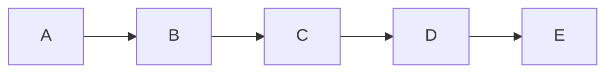
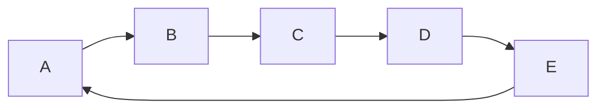

# Custom-Python-Structures

Practice custom data structures.

*Also testing Github Actions on that repo.*

# Badges

[](https://github.com/Quantum-0/custom-python-structures/actions/workflows/tests.yml)
[](https://github.com/Quantum-0/custom-python-structures/actions/workflows/black.yml)
[](https://github.com/Quantum-0/custom-python-structures/actions/workflows/mypy.yml)
[](https://github.com/Quantum-0/custom-python-structures/actions/workflows/lint.yml)
[](https://github.com/Quantum-0/custom-python-structures/actions/workflows/coverage.yml)

# Structures

## LoopList

Sequence structure, implements list with feature, where indexes go by cycle.

### Default `List` sequence:


### Loop List


So, if in default `List` you try to get 5th element from that sequence, you'll get `IndexError: list index out of range`.

But with LoopList 5th element will be **A** again, 6th = **B**, 9th = **E**, 10th = **A** again and etc.

Same with negative indexes: -1th element == **E**, -2th = **D**, -5th == **A**, -6th == **E** again and etc.

That structure also supports slices, but currently without step, so you can try get slise `[-2:7]` and that will return list `[D,E,A,B,C,D,E,A,B]`.

Idea was inspired by [**Josephus Problem**](https://en.wikipedia.org/wiki/Josephus_problem) and with that structure solution will look like that:
```python
ring = LoopList(range(1, n + 1))
while len(ring) > 1:
    ring.rotate(k - 1)
    del ring[0]
return ring[0]
```